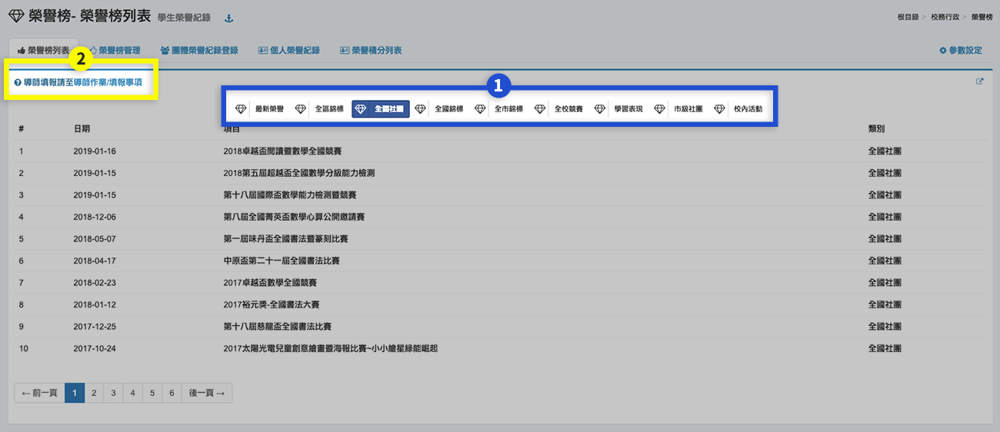
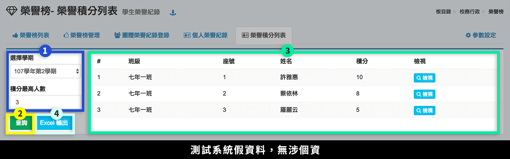

# 榮譽榜

## 榮譽榜列表

1. 標示處可依「競賽分類」篩選榮譽榜項目，競賽分類名稱可在本模組的 [參數設定 ](bang.md#can-shu-she-ding)設定。
2. 若使用者身分為導師，請至導師作業 [填報事項](../jiao-1/zuo.md#tian-bao-shi-xiang) 填報榮譽項目。

## 榮譽榜管理




1. 按下**「新增榮譽榜」**，可新增一個榮譽項目。
2. 按下**「榮譽榜快貼輸入」**，並下載 Excel 範例檔，按照範例格式輸入榮譽項目，即可一次快貼所有學生紀錄。
3. 按下**「填報」**，可依照班級選擇學生填報，請見 填報 頁籤說明。（導師請至 導師作業 [填報事項 ](../jiao-1/zuo.md#tian-bao-shi-xiang)填報）
4. 按下**「列表」**，可查看即時填報情形，請參見 列表 頁籤說明。
5. 按下**「修改設定」**，可修改榮譽項目內容。
6. 按下**「刪除」**，可刪除未填報的項目，有填報的項目請先刪除填報內容，系統才允許刪除。



在榮譽榜管理點下「新增榮譽榜」，會彈跳出此畫面。

1. 按下 **「使用說明」** 按鈕，顯示說明訊息。
2. 選擇**「競賽類別」**、輸入**「主辦單位」**、輸入**「榮譽名稱」**、選擇**「屬性」**。（競賽類別可至 [參數設定](bang.md#ding) 編輯）
3. 勾選**「可填報年級」**。
4. 選擇**「填報起迄日期」**。
5. 輸入**「項目」**、**「積分」**、**「競賽性質」**，此三者為必填。
6. 按下**「增加項目」**，可新增得獎項目。
7. 按下**「存檔」**，儲存該榮譽項目。



在榮譽榜管理點下**「填報」**，會彈跳出此畫面。

1. 選擇填報學生**「班級」**。
2. 點選**「學生姓名」**，點擊完成會顯示在下方。
3. 選擇學生**「得獎項目與積分」**。
4. 輸入**「指導人員」。**
5. 按下**「刪除」**圖是，刪除該填報學生。
6. 按下**「存檔」**，儲存填報內容。



在榮譽榜管理點下**「列表」**，會彈跳出此畫面。

1. 點選**「下載 Excel」**，可下載即時榮譽紀錄。
2. 點選**「刪除」**，可刪除個別學生紀錄。



## 團體榮譽紀錄登錄

1. 當榮譽榜已建立，可依序選擇**「登錄學期」**、**「榮譽榜項目」**、**「得獎名次」**。
2. 選擇**「班級」**，會出現學生名單，可單選或複選，選擇後請先按 **「 選擇」** 按鈕。
3. 顯示已登錄之學生，如要刪除請按 **「刪除」** 圖示按鈕。
4. 按下**「儲存」**，儲存該次填報名單。


可切換不同班級選取學生，選完後一併按 **「選擇」** 按鈕後，被選取學生會一併顯示在右側，再按 **「儲存」** 按鈕 。


## 個人榮譽紀錄

1. 依照所選的班級學生，顯示該生榮譽紀錄。
2. 按 **「列印」** 按鈕可列印該生或全班紀錄；按**「儲存」**按鈕，可儲存該生或全班的 .doc 或 .odt 檔。

## 榮譽積分列表

1. 選擇**「學期」**、篩選**「積分最高人數」**。
2. 按下**「查詢」**。
3. 篩選出的學生會列在標示處，可點選**「檢視」**查看學生榮譽項目。
4. 按下**「Excel 輸出」**，可匯出該次查詢學生的榮譽紀錄。

## 參數設定

> 可調整「榮譽榜」模組的參數，亦可在 [模組管理](../xi-guan-li-mo/module.md) 中調整，可調整之參數如下：

1. 競賽分類設定\
   `國際`\
   `全國`\
   `縣市`\
   `鄉鎮區`\
   `校內`
2. 預設榮譽積分最大值\
   `12`
3. 榮譽榜列表每頁筆數\
   `10 筆`
4.  榮譽榜獨立頁面配色\
    `cerulean`

    配色參考: [https://www.bootstrapcdn.com/bootswatch/](https://www.bootstrapcdn.com/bootswatch/)
