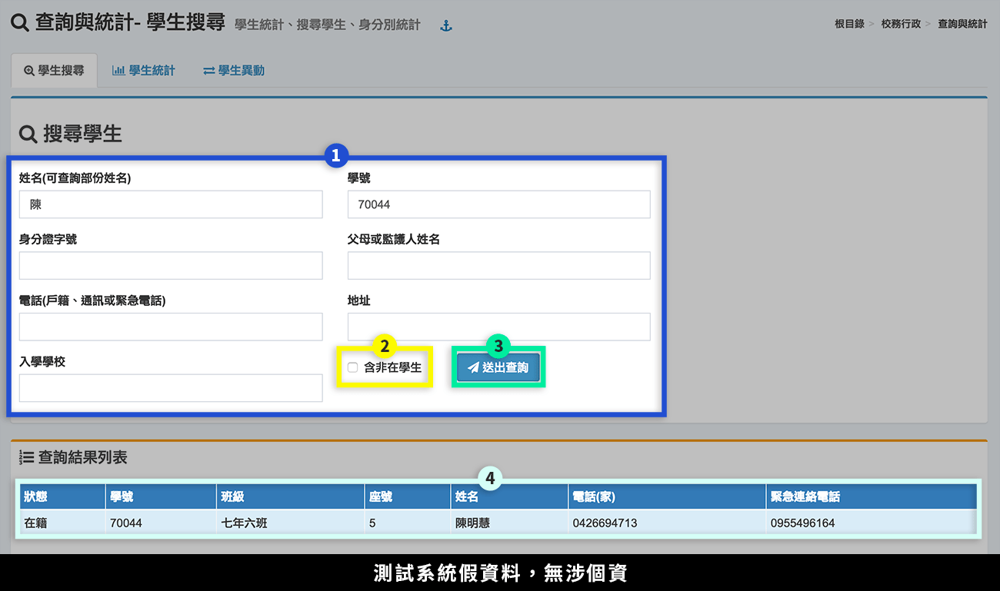
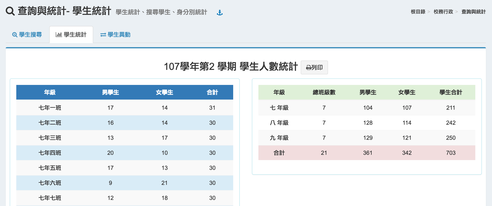
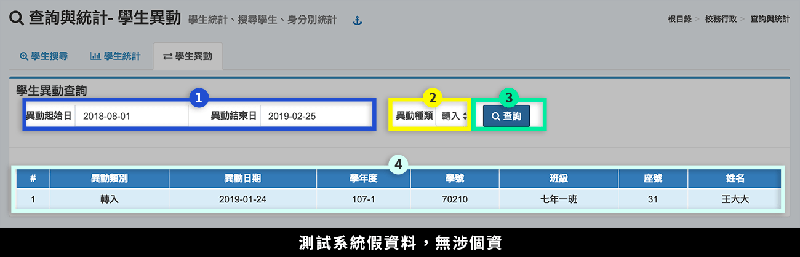

# 查詢與統計

## 學生搜尋

> 提供基本學生資料搜尋。

1. 輸入搜尋條件。
2. 可勾選是否搜尋**「非在學生」**。
3. 按下**「送出查詢」**。
4. 搜尋結果顯示在標示處，結果含：學籍狀態、學號、班級、座號、姓名、電話、緊急聯絡電話。

## 學生統計

此功能提供全校各班男、女生人數統計，以及年級學生數統計，並可列印此統計報表。

## 學生異動

> 提供查詢時間範圍內之學生異動紀錄。

1. 選擇查詢時間區段。
2. 選擇異動種類：轉入、調出、復學。
3. 按下**「查詢」**。
4. 查詢結果顯示在標示處。

