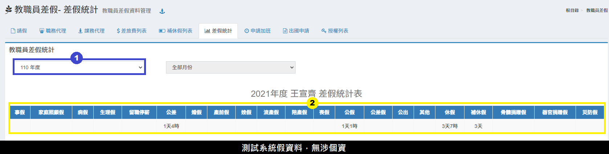
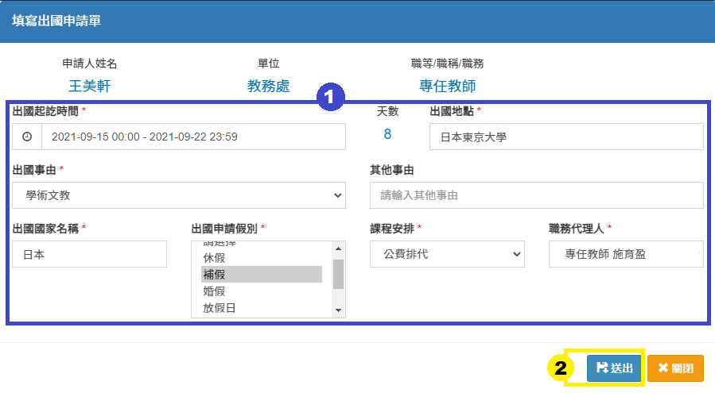
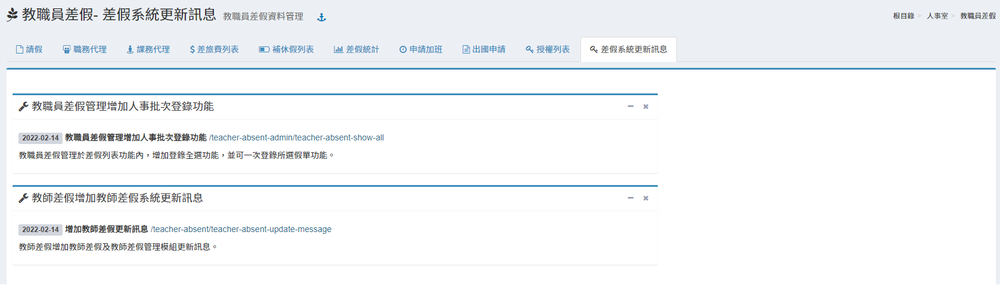
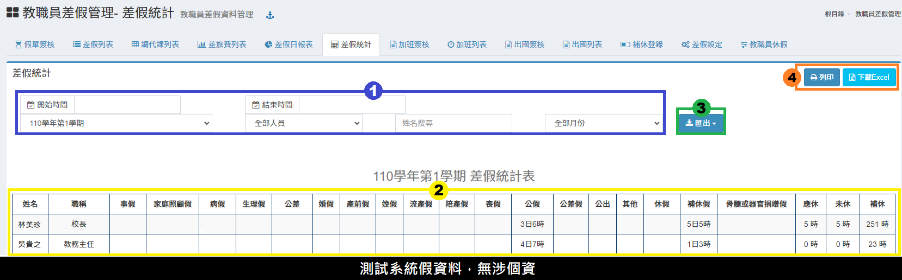

# 教職員差假 / 差假管理(限彰化縣市)

## 初始設定

1. 將**「教職員差假」授權給「教職員」**，教職員透過此模組請假、職務代理簽核、課務代理簽核。（系統群組授權請參考 [模組管理](../xi-guan-li-mo/module.md#mo-zu-guan-li) 教學）
2. 將**「教職員差假管理」授權給「簽核人員、人事或單位主管」**，可分別授權子項目，如：
   * 「假單簽核」、「差假列表」授權給**單位主管**和**所有簽核人員**。
   * 「調代課列表」授權給**教學組長**。
   * 「差旅費列表」授權給**會計主任**。
   * 「差假日報表」、「差假統計」授權給**人事主任**。
   * 「差假設定」授權給**人事主任**、**系統管理員**。
3. 到「[教職員差假管理 > 差假設定](jiao-zhi-yuan-cha-jia-cha-jia-guan-li.md#cha-jia-she-ding)」設定貴校簽核順序。
4. 單位主管是根據「職稱資料」的「所屬處室」欄位判定，例如所屬處室為教務處，則單位主管為教務主任，請至「[系統管理 > 學校基本資料 > 職稱資料](../xi-guan-li-mo/school.md#zhi-chen-zi-liao)」調整各職稱之所屬處室。

## 請假流程

1. 填寫假單（[教職員差假 > 請假](jiao-zhi-yuan-cha-jia-cha-jia-guan-li.md#qing-jia)）
2. 若為公差假，在儲存假單後，可填寫差旅費。
3. 若有課務，且為「自行調課、自費找代」可填寫課務安排。
4. 簽核流程：
   * 職務代理人簽核（[教職員差假 > 職務代理](jiao-zhi-yuan-cha-jia-cha-jia-guan-li.md#zhi-wu-dai-li)）
   * 課務代理人簽核（[教職員差假 > 課務代理](jiao-zhi-yuan-cha-jia-cha-jia-guan-li.md#ke-wu-dai-li)）
   * 單位主管簽核（[教職員差假管理 > 假單簽核](jiao-zhi-yuan-cha-jia-cha-jia-guan-li.md#jia-chan-qian-he)）
   * 貴校設定之核章順序
   * 課務處理人員可安排每筆假單之「課務」

## 教職員差假

### 請假

> 個人請假列表。



.png>)

1. 按下**「填寫假單」**，新增一筆假單。\
   按下**「週期性假單」**，可新增周期性業務之假單。
2. 可針對**「學期」**、**「假別」**、**「假單狀態」**篩選差假紀錄。
3. 標示處列出篩選後的**差假紀錄**。
4. 未簽核的假單，請假人得**「編輯、註銷、複製」**，若已簽核，則須由簽核主管來編輯。
5. 若為公差假，則可在差假紀錄填寫**「差旅費」**。
6. 若課務處理為**「自行調課」**、**「自費找代」**，則可按下**「課務」**填寫異動課程。


請注意！補休假假別之假單，除修改代理人及課務外，一律不修改，若要修改時間、日期及補休選項，請直接註銷該筆假單，重新申請請假程序。



* 公假／公差假日加班，需於 [申請加班](jiao-zhi-yuan-cha-jia-cha-jia-guan-li.md#shen-qing-jia-ban) 模組申請加班並完成簽核程序，方能核定補休時數。
* 如欲使用週期性假單功能，需請人事管理單位至[教職員差假管理>差假設定>參數設定](jiao-zhi-yuan-cha-jia-cha-jia-guan-li.md#cha-jia-she-ding)中設定啟用。




.png>)

1. 選擇**「假別」**。\
   公差、公出、公假：於假日可勾選假日加班選項。
2. 選擇**「學期」**，若沒有未來學期可以選，則需請註冊組先建立新學期。
3. 填寫**「事由」**，公差假需填寫**「公差地點」**；出國可檢附已申請之出國申請表。
4. 填寫差假**「起迄日期、時間」**、**「天數」**、**「時數」**。
5. 選擇**「課程安排方式」**：無課務、自行調課、公費排代、教保員代理、自費找代。
6. 選擇**「職務代理人」**，不得選擇自己。
7. 如有需要，可以上傳證明文件，並填寫文件說明。
8. 按下**「存檔」**，新增假單。


出國申請表填寫說明請參考 [出國申請](jiao-zhi-yuan-cha-jia-cha-jia-guan-li.md#chu-guo-shen-qing)。





1. 選擇**「假別」**。&#x20;
2. 選擇**「學期」**，若沒有未來學期可以選，則需請註冊組先建立新學期。&#x20;
3. 選擇**「週期性星期」**、**「開始結束時間」**，填入時間後系統會自動計算**「每次小時數」**。 &#x20;
4. 填寫**「事由」**，公差、公假需填寫**「公差地點」**。&#x20;
5. 填寫週期性請假**「起迄日期」**。&#x20;
6. 選擇**「課程安排方式」**：無課務、自行調課、公費排代、教保員代理、自費找代。&#x20;
7. 選擇**「職務代理人」**，不得選擇自己。&#x20;
8. 如有需要，可以上傳證明文件，並填寫文件說明。&#x20;
9. 按下**「存檔」**，新增假單。


如欲使用週期性假單功能，需請人事管理單位至[教職員差假管理>差假設定>參數設定](jiao-zhi-yuan-cha-jia-cha-jia-guan-li.md#cha-jia-she-ding)中設定啟用。




.png>)

1. 按下**「填寫差旅費」**。
2. 每個假單，可依不同日期分次填寫多筆「差旅費」。
3. 會計主任簽核後會顯示註記。
4. 若會計主任沒有簽核，則可以**「編輯、刪除」**差旅費。
5. 按下**「關閉」**，結束編輯。





1. 在請假人的課表按下**「新增」**，或是按下**「+」**。
2. 可在右側查詢本校教師課表。
3. 填寫完調代課會呈現在標示處。
4. 已安排之課務可**「編輯」**或**「刪除」**。



### 職務代理

> 有被指定為職務代理人的教職員，即可簽核。

1. 選擇**「學期、請假教師、假別」**可篩選待簽核的假單。
2. 若已簽核的假單，可在後續主管尚未簽核前點擊「已簽核」按鈕來取消簽核。
3. 按下**「未簽核」**按鈕來簽核假單。
4. 若後續主管已簽核，職務代理人則無法取消簽核。

### 課務代理

> 有被指定為課務代理人的教職員，即可簽核。

1. 選擇**「學期、請假教師、假別、代理方式」**可篩選待簽核的假單。
2. 按下**「未簽核」**按鈕來簽核課務代理。
3. 若已簽核的假單，可按下**「已簽核」**按鈕來取消簽核。

### 差旅費列表

> 個人差旅費列表。

.png>)

1. 選擇**「差旅費申請狀態、申請月份」**可篩選差旅費申請紀錄。
2. 標示處呈現差旅費申請紀錄，及會計主任是否簽核。
3. 點擊假單序號可查看該筆假單及差旅費明細，如下圖:
4. 尚未簽核完畢之差旅費申請，可勾選列印**「差旅費報告表」**。

### 補休假列表

本功能會列出教師個人差假時數資料，統計時數為通過人事人員登錄過之假單時數。

標示處顯示已申請該補休時數之假單，點擊可查看假單狀態。


請留意，補休時數需於加班事實日隔天方能使用。


### 差假統計

> 本功能會列出教師個人差假時數統計。

1. 依教師職員身分選擇統計之**「學年度」**、**「年度」**。
2. 標示處顯示個人差假統計日數。

### 申請加班

1. 選擇**「學期」**、**「狀態」**篩選已申請之加班紀錄。&#x20;
2.  點擊**「新增申請」**，於新增視窗中填寫加班資料，如下圖

    &#x20;
3. 標示處顯示申請加班記錄列表，可查看各加班申請狀態。&#x20;
4. 在單位主管尚未簽核前，可**「編輯」**或**「註銷」**該筆加班申請。
5. 已核准登錄之加班申請，可至補休假列表查看。

### 出國申請




1. 選擇**「學期、表單狀態」**篩選出國申請紀錄。&#x20;
2. 點擊**「出國申請」**可新增出國申請：一般出國申請、赴大陸申請。
3. 可**「註銷」**、**「檢視」**該筆申請紀錄，尚未簽核之申請可**「編輯」**內容。
4. 已簽核之申請紀錄無法編修內容。&#x20;
5. 赴大陸之申請，返臺後須**「填寫返臺意見通報表」**備查。


依臺灣地區公務員及特定身分人員進入大陸地區作業規定辦法，申請進入大陸地區之人員，應於返臺後七個工作日內， 填具赴陸人員返臺通報表（如附件五）。現職人員送交所屬機關（構），機關首長送交所屬機關之上一級機關，縣（市）長送交移民署，直轄市長送交行政院，受委託人員送交委託機關；管制赴陸之退離職人員送交原服務機關（構）、委託機關備查。





1. 填寫申請內容。&#x20;
2. 點擊**「送出」**，儲存該筆申請紀錄。




1. 填寫申請內容。
2. 點擊**「送出」**，儲存該筆申請紀錄。



### 授權列表

本功能列表出已被授權之人員。

### 差假系統更新訊息

本功能提供教職員檢視差假系統版本更新情形。

## 教職員差假管理

### 假單簽核

> 建議授權給單位主管和所有簽核人員。

1. 選擇**「學期、簽核狀態、假別、請假教職員」**篩選差假紀錄。
2. 代理人或單位主管位沒有簽核時，後續核章人員都無法簽核，需依序簽核。
3. 出現**「簽核、退件」**表示該筆假單需要簽核，當請假人為「免課務簽核之職稱」，在課務處理人員那欄會自動帶出「免簽核」（如圖中教學組長欄位）。
4. 管理人員可勾選**「全選**」，進行批次簽核作業。
5.  點擊**「簽核備註語庫」**，可編修簽核備註語庫供退件假單時快速選擇已自訂之退件原因，如下圖:

    

### 差假列表

> 建議授權給單位主管和所有簽核人員。

.png>)

1. 選擇**「學期、請假教師、假別、假單狀態」**篩選假單紀錄。
2. 假單登錄人員，在假單簽核完畢後可以按下**「登錄」**; 勾選假單點擊上方登錄可進行**「批次登錄」**。
3. 擁有「差假列表」權限人員，都可以**「編輯」**假單；擁有「假單登錄」權限人員，可以**「編輯、註銷」**假單。（如代理人尚未簽核，僅能由請假人自行註銷）
4. **「新增災防假」**，學校主管可以幫全體教職員一次性申請災防假使用。\
   **「刪除災防假」**，可勾選全選，一次性刪除災防假。

### 調代課列表

> 建議授權給教學組長。

1. 選擇**「學期、請假教師、假別、課務代理方式、代理教師」**篩選課務安排紀錄。
2. 可透過課務代理人「已簽核註記」來確認課務安排狀況，並通知代理人。
3. 可下載調代課報表。


注意！課務代理人簽核與否不影響整筆假單的簽核！


### 差旅費列表

> 建議授權給會計主任。

1. 選擇**「學期、請假教師、假單狀態**」篩選差旅費申請紀錄。&#x20;
2. 可查看該筆申請差旅費之假單登錄狀況。&#x20;
3. 擁有模組權限者，可簽核差旅費。勾選**「全選」**可批次簽核。&#x20;
4. 可下載差旅費報表。


注意！差旅費簽核與否不影響整筆假單的簽核！


### 差假日報表

> 建議授權給人事主任。

.png>)

1. 選擇日報表統計之**「開始、結束時間」**。
2. 表格呈現統計時間內之假單。
3. 點擊**「查詢」**旁下拉標示，可查詢區間假單：本週、本月、最近三個月。
4. 可**「列印、下載」**差假日報表。

### 差假統計

> 建議授權給人事主任。

1. 選擇統計之**「學年／曆年」**、**「教師職員身分」**、**「假單月份」**。或輸入統計**「起訖時間」**、**「教職員姓名」**。
2. 此處僅會計算已登錄差假紀錄。
3. 可匯出**「人事行政總處格式之 CSV 檔(差假)」、「人事行政總處格式之 JSON檔(差假與加班)」、「未休假加班費清冊(兼行政教師)」、「未休假加班費清冊(職員)」**。
4. 可**「列印」**及**「下載」**統計結果。


* 匯出兼行政教師未休假加班費印領清冊：請先選擇「**學年度」**。\
  匯出職員未休假加班費印領清冊：請先選擇「**年度」**。
* 匯出限制: 無法匯出「公假具公差性質」 及 「是否申請國民旅遊補助」兩個欄位。


### 加班簽核

本功能提供單位主管及假單簽核人員使用，所以請將權限設為各單位主管及簽核人員。

1. 選擇**「學期、簽核狀態、加班教職員、加班類型」**篩選加班紀錄。
2.  標示處為加班申請簽核狀態&#x20;

    「未簽核」表示該筆加班申請單需要簽核，按下「未簽核」按鈕來簽核加班申請單。

    「已簽核」表示此筆加班申請單已簽核，若已簽核的假單，可在後續主管尚未簽核前，點擊「已簽核」按鈕來取消簽核。 若後續主管已簽核，則無法取消簽核。&#x20;
3.  具假單登錄權限人員，在申請單簽核完畢後可以按下**「登錄」**，亦可以**「編輯、註銷」**申請單，如下圖

    

### 加班列表

本功能權限建議指定為單位主管及差假核章人員使用。

.png>)

1. 選擇**「加班類型」**、**「教職員」**、**「加班起訖時間」**篩選加班列表。
2. 標示處列出篩選後的加班列表。
3. 可**「編輯」**教職員加班補休時數或**「刪除」**此筆加班紀錄。
4. 點擊**「匯出」**，可匯出加班本文檔之CSV檔。

### 出國簽核

1. 選擇**「學期、簽核狀態、申請表類型、起訖時間」**，點擊**「查詢」**可查詢出國簽核紀錄。&#x20;
2. 可**「檢視」**、**「列印」**出國請示申請表。&#x20;
3. 具簽核權限人員可**「簽核」**或**「退件」**該筆出國申請。

### 出國列表

1. 選擇**「學期、申請表類型、起訖時間」**，點擊**「查詢」**可查詢出國簽核紀錄。&#x20;
2. 具假單登錄權限人員，可按下**「登錄」**，登錄此筆出國申請。&#x20;
3. 擁有「出國列表」權限人員，都可以**「編輯、註銷」**出國申請單。&#x20;
4. 點擊**「匯出出國資料」**，即可下載出國申請表列表。

### 補休登錄




1. 選擇**「補休時數狀態」**或**「輸入事由」**即可查詢補休時數紀錄。&#x20;
2.  點擊**「新增補休」**，可新增補休紀錄。如下圖

    
3. 點擊**「整批匯入」**，可批次匯入多筆補休案件，請務必參照說明步驟操作。&#x20;
4.  點擊**「新增/修改補休人員」**，可新增/修改補休人員（請見下一籤列）

    點擊**「刪除補休」**可刪除該筆補休紀錄。

    點擊**「修改補休」**可編輯該筆補休紀錄內容。
5. 點擊**「使用狀況列表」**，可查看補休人員列表及使用狀況。




1. 選擇**「加班起訖時間」**及確認**「核發時數」**。&#x20;
2. 選擇**「職別」**，標示3處會顯示該職別下的教職員選單。
3. 勾選補休人員，勾選**「全選」**可一次選擇該職別所有職員。&#x20;
4. 點擊**「儲存」**以存取此次編輯，下方資訊欄會顯示已選取教師名單。&#x20;
5. 點擊垃圾桶圖示可**「刪除」**已新增之補休人員，完成後請務必點擊**「儲存」**存取此次編輯。



### 差假設定

> 建議授權給人事主任、系統管理員。

.png>)


* 系統預設核章人員**第一順位為「職務代理人」**，**第二順位為「單位主管」**。
* 單位主管是依據「教職員職稱之所屬處室」判定，例如：科任教師若歸類在教務處，其單位主管就是教務主任。要調整所屬處室請到「[學校基本資料 > 職稱資料](../xi-guan-li-mo/school.md#zhi-chen-zi-liao)」設定。


1. 按下**「新增」**，新增「職務代理人、單位主管（系統已預設，不需設定）」之後的核章人員。
2. 勾選核章人員的簽核功能：課務處理、假單登錄（也可以不勾選，則只會有簽核功能）。
3. 可**「刪除」**已設定的核章人員。
4. 可**「拖曳移動」**核章人員的順序。
5. 拖曳完成務必按下**「更新排序」**。
6. 可**「新增」**免課務核章的職稱，如校長、人事主任等無課務之職稱。
7. 可**「刪除」**不需課務核章的職稱。
8. **「參數設定」**區塊可進行模組參數調整


簽核順序經過設定後，請盡量不要更動，若實在有必要異動，請務必讓目前所有尚未簽核之假單均完成簽核及登錄程序。簽核順序一旦經過異動，先前所有假單也會套用新的簽核順序，會導致簽核資料無法對應的問題。


### 教職員休假

> 本模組為提供差假統計模組之應休欄位資料

.png>)

1. 選擇**「學期、教師」**來查詢教職員休假總時數。&#x20;
2. 點擊**「編輯」**按鈕，可直接修改教職員休假總時數。


教師類別以學年計算，職員工以年度計算。學期選單只為篩選當學期在職之教職員，輸入之資料為整年度或整學年度之時數， 故選擇110-1學期及選擇110-2學期輸入之資料都為同一筆，如為教師就是110學年度可休時數，職員工就是110年度可休時數。


###

> 配合行政院事行政總處年度辦公日曆表設定放假日及上班日

<figure><figcaption></figcaption></figure>

1. 選擇**「學年度」**。下方區塊會顯示是否已設置的訊息。
2. 直接點擊日曆上的日期即可調整上班日／休息日。上班日。
3. 點擊**儲存**此次編輯。


* 請依據[ 人事行政局](https://www.dgpa.gov.tw/information?uid=30\&pid=11070)公告之上班日期修正。
* 再依據各校行事曆設定各校個別之上班日(如校慶活動)。
* 每年6月起才可設定隔年行事曆。

