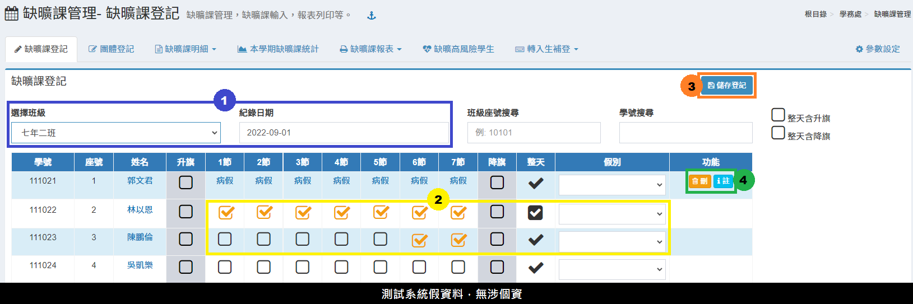

# 教職員差假 / 差假管理

## 初始設定

1. 將**「教職員差假」授權給「教職員」**，教職員透過此模組請假、職務代理簽核、課務代理簽核。（系統群組授權請參考 [模組管理](../xi-guan-li-mo/module.md#mo-zu-guan-li) 教學）
2. 將**「教職員差假管理」授權給「簽核人員、人事或單位主管」**，可分別授權子項目，如：
   * 「假單簽核」、「差假列表」授權給**單位主管**和**所有簽核人員**。
   * 「調代課列表」授權給**教學組長**。
   * 「差旅費列表」授權給**會計主任**。
   * 「差假日報表」、「差假統計」授權給**人事主任**。
   * 「差假設定」授權給**人事主任**、**系統管理員**。
3. 到「[教職員差假管理 &gt; 差假設定](jiao-zhi-yuan-cha-jia-cha-jia-guan-li.md#cha-jia-she-ding)」設定貴校簽核順序。
4. 單位主管是根據「職稱資料」的「所屬處室」欄位判定，例如所屬處室為教務處，則單位主管為教務主任，請至「[系統管理 &gt; 學校基本資料 &gt; 職稱資料](../xi-guan-li-mo/school.md#zhi-chen-zi-liao)」調整各職稱之所屬處室。

## 請假流程

1. 填寫假單（[教職員差假 &gt; 請假](jiao-zhi-yuan-cha-jia-cha-jia-guan-li.md#qing-jia)）
2. 若為公差假，在儲存假單後，可填寫差旅費。
3. 若有課務，且為「自行調課、自費找代」可填寫課務安排。
4. 簽核流程：
   * 職務代理人簽核（[教職員差假 &gt; 職務代理](jiao-zhi-yuan-cha-jia-cha-jia-guan-li.md#zhi-wu-dai-li)）
   * 課務代理人簽核（[教職員差假 &gt; 課務代理](jiao-zhi-yuan-cha-jia-cha-jia-guan-li.md#ke-wu-dai-li)）
   * 單位主管簽核（[教職員差假管理 &gt; 假單簽核](jiao-zhi-yuan-cha-jia-cha-jia-guan-li.md#jia-chan-qian-he)）
   * 貴校設定之核章順序
   * 課務處理人員可安排每筆假單之「課務」

## 教職員差假

### 請假

> 個人請假列表。




1. 按下**「填寫假單」**，新增一筆假單。（填寫教學請參考下一頁籤）
2. 可針對**「學期」**、**「假別」**、**「假單狀態」**篩選差假紀錄。
3. 標示處列出篩選後的**差假紀錄**。
4. 未簽核的假單，請假人得**「編輯、刪除」**，若已簽核，則須由簽核主管來編輯。
5. 若為公差假，則可在差假紀錄填寫**「差旅費」**。
6. 若課務處理為「自行調課」、「自費找代」，則可按下**「課務」**填寫異動課程。




1. 選擇**「假別」**。
2. 選擇**「學期」**，不得選擇過去學期，若沒有未來學期可以選，則需請註冊組先建立新學期。
3. 填寫**「事由」**，公差假可填寫**「公差地點」**。
4. 填寫差假**「起迄日期、時間」**、**「天數」**、**「時數」**。
5. 選擇**「課程安排方式」**：無課務、自行調課、公費排代、教保員代理、自費找代。
6. 選擇**「職務代理人」**，不得選擇自己。
7. 如有需要，可以上傳證明文件，並填寫文件說明。
8. 按下**「存擋」**，新增假單。




1. 按下**「填寫差旅費」**。
2. 每個假單，可依不同日期分次填寫多筆「差旅費」。
3. 會計主任簽核後會顯示註記。
4. 若會計主任沒有簽核，則可以**「編輯、刪除」**差旅費。
5. 按下**「關閉」**，結束編輯。




1. 在請假人的課表按下**「新增」**，或是按下**「+」**。
2. 可在右側查詢本校教師課表。
3. 填寫完調代課會呈現在標示處。
4. 已安排之課務可**「編輯」**或**「刪除」**。



### 職務代理

> 有被指定為職務代理人的教職員，即可簽核。

1. 選擇**「學期、請假教師、假別」**可篩選待簽核的假單。
2. 若已簽核的假單，可在後續主管尚未簽核前「已簽核」按鈕來取消簽核。
3. 按下「未簽核」按鈕來簽核假單。
4. 若後續主管已簽核，職務代理人則無法取消簽核。

### 課務代理

> 有被指定為課務代理人的教職員，即可簽核。

1. 選擇**「學期、請假教師、假別、代理方式」**可篩選待簽核的假單。
2. 按下「未簽核」按鈕來簽核假單。
3. 若已簽核的假單，可按下「已簽核」按鈕來取消簽核。

### 差旅費列表

> 個人差旅費列表。

1. 選擇**「學期、差旅費申請狀態、申請月份」**可篩選差旅費申請紀錄。
2. 標示處呈現差旅費申請紀錄，及會計主任是否簽核。
3. 可列印**「差旅費報告表」**。

### 差假統計

> 個人差假統計。

1. 選擇統計之**「學期」**。
2. 標示處顯示個人差假統計日數。

## 教職員差假管理

### 假單簽核

> 建議授權給單位主管和所有簽核人員。

1. 選擇**「學期、簽核狀態、假別、請假教職員」**篩選差假紀錄。
2. 代理人或單位主管位沒有簽核時，後續核章人員都無法簽核，需依序簽核。
3. 出現**「未簽核」**表示該筆假單需要簽核，當請假人為「不須課務簽核之職稱」，在課務處理人員那欄會自動帶出「已簽核」（如圖中教學組長欄位）。

### 差假列表

> 建議授權給單位主管和所有簽核人員。

1. 選擇**「學期、請假教師、假別、假單狀態」**篩選假單紀錄。
2. 假單登錄人員，在假單簽核完畢後可以按下**「登錄」**。
3. 擁有「差假列表」權限員人，都可以**「編輯、刪除」**假單。
4. 此處的**「填寫假單」**是給學校主管可以幫其他教職員請假使用，因此職務代理人並未設定不可填寫自己（請留意主管自己請假時，不要將職務代理人填成自己）

### 調代課列表

> 建議授權給教學組長。

1. 選擇**「學期、請假教師、假別、課務代理方式、代理教師」**篩選課務安排紀錄。
2. 可透過課務代理人「已簽核註記」來確認課務安排狀況，並通知代理人。
3. 可下載調代課報表。


注意！課務代理人簽核與否不影響整筆假單的簽核！


### 差旅費列表

> 建議授權給會計主任。

1. 選擇**「學期、請假教師、假單狀態」**篩選差旅費申請紀錄。
2. 擁有模組權限者，可簽核差旅費。
3. 可下載差旅費報表。


注意！差旅費簽核與否不影響整筆假單的簽核！


### 差假日報表

> 建議授權給人事主任。

1. 選擇日報表統計之**「開始、結束時間」**。
2. 表格呈現統計時間內之假單。
3. 可**「列印」**統計日報表。

### 差假統計

> 建議授權給人事主任。

1. 選擇統計之**「學期、學年或曆年」**、**「教職員」**、**「假單月份」**。
2. 此處僅會計算已登錄差假紀錄。
3. 可匯出**「人事總局格式之 CSV 檔。**
4. 可**「列印」**統計結果。

### 差假設定

> 建議授權給人事主任、系統管理員。


* 系統預設核章人員**第一順位為「職務代理人」**，**第二順位為「單位主管」**。
* 單位主管是依據「教職員職稱之所屬處室」判定，例如：科任教師若歸類在教務處，其單位主管就是教務主任。要調整所屬處室請到「[學校基本資料 &gt; 職稱資料](../xi-guan-li-mo/school.md#zhi-chen-zi-liao)」設定。


1. 按下**「新增」**，新增「職務代理人、單位主管（系統已預設，不需設定）」之後的核章人員。
2. 勾選核章人員的簽核功能：課務處理、假單登錄（也可以不勾選，則只會有簽核功能）。
3. 可**「刪除」**已設定的核章人員。
4. 可**「拖曳移動」**核章人員的順序。
5. 拖曳完成務必按下**「更新排序」**。
6. 可**「新增」**不需課務核章的職稱，如校長、人事主任等無課務之職稱。
7. 可**「刪除」**不需課務核章的職稱。

