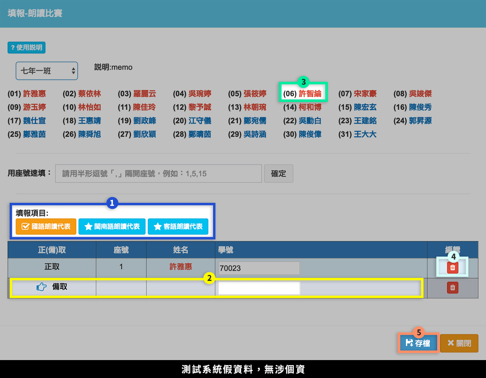
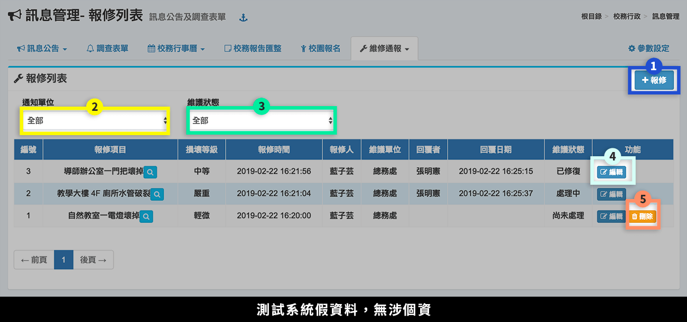

# 訊息管理

## 訊息公告

### 訊息管理

**已發布**的訊息，會顯示在首頁**「校務佈告欄」**。


[參數設定](xi-guan-li.md#ding) 可設定「佈告欄獨立頁面顯示筆數」、「佈告欄獨立頁面是否顯示標題」，以及「不顯示幾年前的訊息」，也可更改佈告欄獨立頁面的配色。


1. 要新增訊息公告，請按 **「新增訊息」** 按鈕，參考 [新增訊息](xi-guan-li.md#xin-zeng-xi) 介紹。
2. 要管理個人已經公告之訊息，可以按 **「訊息管理」** 按鈕，會篩選出個人張貼之公告。
3. 要刪除公告可以按 **「刪除」** 按鈕，將該筆公告刪除。
4. 要修改訊息可以按 **「修改」** 按鈕，會出現如同新增訊息般畫面，操作方式如同 [新增訊息](xi-guan-li.md#xin-zeng-xi)。
5. 按 **「檢視」** 按鈕，會跳出新視窗如下圖，顯示該筆公告之內容。

### 新增訊息




1. 輸入訊息標題文字。
2. 選擇訊息分類。
3. 勾選是否為內部文件，若勾選「公開」文件，則不須登入系統就可以看見。\
   到 [參數設定](xi-guan-li.md#ding)，可設定「內部」文件是否顯示標題，讓訪客可查看標題。
4. 輸入訊息公告起訖日期，在設定期間內才會出現在公告區。
5. 輸入訊息內容。
6. 確定資料正確後可以按 **「儲存」** 按鈕將資料儲存並離開編輯畫面。



本系統插入附件分為兩階段，須上傳檔案到雲端，再將雲端檔案插入在訊息中。


附件檔案上傳格式，可在 [參數設定](xi-guan-li.md#ding) 新增或刪除。


1. 點選「選取檔案」。
2. 確認所選檔案，可刪除。
3. 點選「開始上傳」，將檔案上傳到雲端。

1. 回到訊息內容編輯框，可依標示處的三種插入方式插入附件。
2. 成功插入附件畫面，如標示處所示。



### 分類管理




1. 要新增訊息分類，按 **「新增分類」** 按鈕。
2. 在現有分類下方會出現輸入框，請輸入分類名稱後按 **「確定」** 按鈕即可新增。




1. 要篩選出現之分類，可按 **「啟用中」** 按鈕或 **「已停用」** 按鈕來顯示。
2. 要修改已增加之分類名稱，可按 **「編輯」** 按鈕修改分類名稱。
3. 要修改或編輯分類可以使用之群組或使用者，可按 **「授權」** 按鈕。
4. 要停用分類可以使用之群組或使用者，可按 **「停用」** 按鈕。
5. 要刪除分類可以使用之群組或使用者，可按 **「刪除」** 按鈕。
6. 要排序顯示分類，可按**「排序分類」**按鈕，以拖曳的方式手動排序。



## 調查表單

> 本功能提供學校線上填報調查功能，如果有調查事項，在使用者登入後會出現需要填報之調查表。

需要填報的調查表單會顯示在首頁。




1. 按下**「新增表單」**。
2. 輸入表單主旨。
3. 輸入說明內容（選填）。
4. 若已輸入題目可預覽內容。
5. 新建之表單請先點選**「儲存表單」**，才能開始設計題目。




1. 點選**「新增題目」**，即可在下方編輯題目內容。
2. 已新增的題目會列在右側，滑鼠移到題目上，可編輯、刪除或複製題目。

#### 各類型題目預覽

1. 複選題
2. 單選題
3. 下拉選單：單選題的變化格式。
4. 表格：設定固定填充欄位數，如圖中標示僅能填寫三筆資料。
5. 動態表格：可設定輸入筆數，或選擇不限定，如圖中標示，使用者可自由增減資料筆數。
6. 單行填充：可選擇回傳資料型態，如日期、整數、數字（允許小數）、email。
7. 多行填充：可選擇設定或不設定字數。




1. 到調查表單列表，確認表單狀態。
2. 點選**「發布」**。
3. 勾選**授權填報對象**，只有符合資格之登入者才能在首頁看見本調查表。
4. 選擇開始、結束填報時間，只有在該段時間調查表才能填報。
5. 將表單狀態設定為「公開填報」。（勾選「草稿」即未公開表單）
6. 點選「存檔」儲存設定。



## 校務行事曆

### 瀏覽校務行事曆

瀏覽每週各單位之行事，並提供列印功能。

### 重要行事列表

可查看每週之重要行事，並提供列印功能。

### 編修校務行事曆

1. 點選**「新增行事」**。
2. 選擇**「單位類別」**。
3. 輸入**「行事曆內容」**。
4. 勾選是否為**「重要行事」**，重要行事可另外獨立瀏覽。
5. 指定**「排序」**，數字越小在當週行事項目中會排越前面。
6. 勾選**「週次」**（可複選）。
7. 點選**「存檔」**，以儲存行事曆。

### 設定校務行事曆


在寒暑假期間，需要編輯新學期行事曆時，必須到 [學期初設定](../jiao/qi-chu-ding.md#ri) 新增學期，再回到本功能**公開行事曆**。



[參數設定](xi-guan-li.md#ding) 可更改行事曆獨立頁面的配色。


1. 按下**「設定」**。
2. 輸入行事曆單位標題，以半形逗號隔開。（亦可在 [參數設定](xi-guan-li.md#ding) 設定）
3. 選擇是否公開行事曆。
4. 按下**「存檔」**儲存設定。

## 校務報告匯整

1. 按 **「新增事項」** 按鈕會跳出編輯視窗，可以在表單內填報告事項內容。
2. 按 **「編修」** 按鈕如同新增事項會跳出新視窗可以編修事項內容。
3. 按 **「刪除」** 按鈕可以刪除該報告事項。
4. 按 **「列印彙整表」** 按鈕可以將該會議資料依照各處室報告內容彙整起來並列印。
5. 按 **「顯示大字版」** 按鈕可以將該會議資料於新視窗開啟較大字形之內容，方便直接投影於會議中使用（如下圖）。

1. 大字報會顯示當週報告者的職稱。（報告排序可在 [參數設定](xi-guan-li.md#ding) 編輯，可依職稱、處室排序）
2. 內容顯示在標示處。

## 校園報名




1. 欲新增報名項目，請點選**「新增報名」**。
2. 擁有「校園報名」模組權限者，可填報設定年級之學生。導師可於導師作業中的 [填報事項](../jiao-1/zuo.md#tian-shi) 填報。
3. 按下**「填報結果」**，可查看即時填報狀況。
4. 按下**「修改設定」**，可調整報名項目的內容（如同新增報名畫面）。
5. 按下**「刪除」**，可刪除報名項目。



於校園報名頁面，點擊「新增報名」。

1. 輸入報名項目的名稱與說明。
2. 選擇填報起迄日期。
3. 選擇可填報年級，以及匯出的資料。
4. 輸入填報項目、正備取人數，並可自行新增項目。
5. 輸入填報欄位（填報時會自動帶出班級、座號、姓名）。
6. 按下**「存檔」**，儲存編修內容。



於校園報名頁面，選擇一個項目點擊「填報」；導師身分請到導師作業的 [填報事項](../jiao-1/zuo.md#tian-shi) 填報。

1. 若有多個項目，請先選擇填報項目。
2. 點擊欲輸入的那一**「列」**，選取成功會出現**「手指圖示」**。
3. 選擊填報學生姓名。
4. 填報學生可**「刪除」**。
5. 點擊**「存檔」**，儲存填報內容。



於校園報名頁面，選擇一個項目點擊「填報結果」。

1. 可查看班級填報狀況。
2. 可查看各個項目填報狀況。
3. 點擊**「下載填報結果」**，輸出結果 Excel 檔。



## 維修通報

### 報修列表




1. 按下**「報修」**，填寫報修單。
2. 可依通知單位篩選報修項目，欲編輯通知單位請至 [報修單位設定](xi-guan-li.md#xiu-wei-ding)。
3. 可依維護狀態篩選報修項目，維護狀態分為：尚未處理、處理中、已修復。
4. 使用者可**「編輯」**自己填寫的報修單。
5. 使用者可**「刪除」**自己填寫的報修單。


可將「報修列表」授權給「教職員」，讓所有教職員都可以線上報修。\
注意！「教職員」屬系統群組，授權系統群組請參考 [模組管理](../xi-guan-li-mo/module.md#mo-zu-guan-li) 的操作說明。




於報修列表按下**「+報修」**按鈕。

1. 選擇報修單位。
2. 輸入標題。
3. 選擇損壞狀態：輕微、中等、嚴重。
4. 輸入地點。
5. 輸入狀況描述。
6. 按下**「存檔」**，儲存報修單。



### 報修單位設定

1. 按下**「新增單位」**，輸入單位名稱、Email。
2. 按下**「編輯」**，可修改單位名稱、Email。
3. 按下**「權限」**，設定單位回覆通報的人員，有權限者才能回復維修狀況。
4. 編輯權限，可授權給：處室、職稱、職稱類別或自訂群組。
5. 編輯權限，顯示所選的群組，亦可刪除。


欲使用 mail 通知通報單位，請先到「參數設定」設定**系統 mail**，所有訊息通報將以此 mail 位址發送郵件，請參考下節 [通報 Email 設定](xi-guan-li.md#tong-bao-email-she-ding) 說明。


### 通報 Email 設定

維修通報的 Email 分為三種角色：

1. **系統 mail**：請在本模組 [參數設定](xi-guan-li.md#ding) 第 10、11 點設定（須填入 gamil 帳戶密碼）
   * 當有使用者填寫維修事項時，會以此 mail 通知報修單位。
   * 當報修單位回覆維修狀況時，會以此 mail 通知使用者。
2. **報修單位 mail**：請在本模組 [報修單位設定](xi-guan-li.md#xiu-wei-ding) 設定，沒有設定即不會收到通知。
3. **使用者 mail**：請在使用者「個人資料」設定，沒有設定即不會收到通知。


系統 mail 須為 gmail，且設定為「[允許低安全性應用程式存取](https://support.google.com/accounts/answer/6010255?hl=zh-Hant)」，設定步驟如下：

1. 前往您的 [Google 帳戶](https://myaccount.google.com)。
2. 按一下左側導覽面板上的 \[安全性]。
3. 在頁面底部的「低安全性應用程式存取權」面板上，按一下 \[開啟存取權]。\
   如果系統未顯示這項設定，表示您的管理員可能已關閉低安全性應用程式帳戶存取權。


## 參數設定

> 可調整「訊息管理」模組的參數，亦可在 [模組管理](../xi-guan-li-mo/module.md#mo-guan-li) 中調整，可調整之參數如下：

1. 校務行事曆預設單位標題\
   `校園大事,教務,訓導,總務,輔導`
2. 訊息管理-預設上傳檔案的副檔名\
   `jpg,png,odt,ods,odp,odg,pdf,mp3,mp4,ogv,zip,7z`
3. 訊息管理-內部文件是否顯示標題\
   `顯示標題`\
   `不顯示`
4. 訊息管理-獨立頁面每頁預設筆數\
   `10`
5. 訊息管理-多少年以前所發布的訊息不顯示在首頁佈告欄及獨立頁面（0表示全部顯示）\
   `3`
6.  訊息管理-佈告欄獨立頁面配色\
    `cerulean`

    配色參考: [https://www.bootstrapcdn.com/bootswatch/](https://www.bootstrapcdn.com/bootswatch/)
7.  訊息管理-佈告欄獨立頁面是否顯示標題\
    `顯示標題`\
    `不顯示`

    獨立頁面標題顯示，例：OO國民小學校務佈告欄
8.  訊息管理-行事曆獨立頁面配色\
    `cerulean`

    配色參考: [https://www.bootstrapcdn.com/bootswatch/](https://www.bootstrapcdn.com/bootswatch/)
9. 校務報告匯整表排序依職稱順序\
   `依處室順序`
10. 訊息代理傳遞 Email（須為 Gmail，貴校訊息將透過此郵件設定寄出通知信函）\
    `XXX@gmail.com`
11. 訊息傳遞 Email 之密碼（上方郵件之密碼）\
    `XXXXXX`
